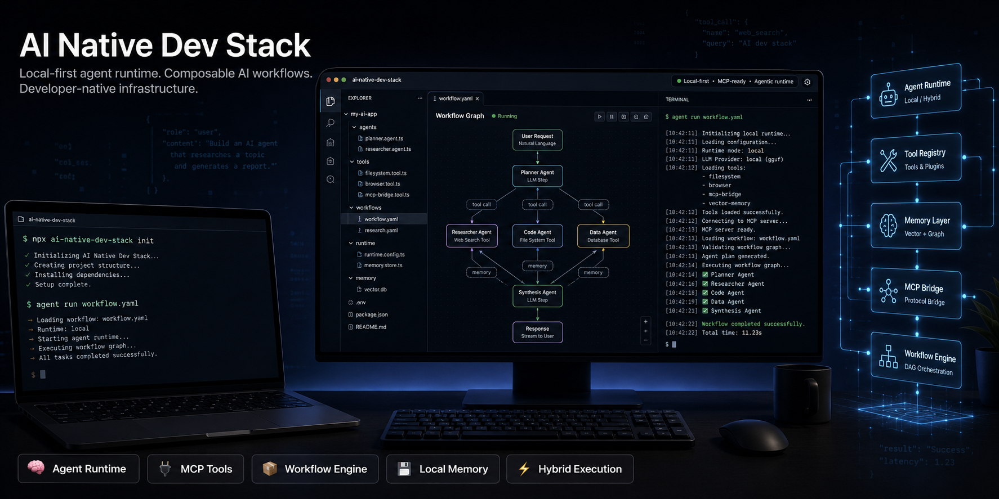

<div align="center">



English · [Français](README.fr.md)

# AI Native Dev Stack

> **Cross-agent context engineering, persistent project knowledge, and deterministic verification for AI coding agents.**

Help coding agents understand your codebase, preserve engineering knowledge across sessions, follow one shared method, and prove completed work before the project accepts it.

[](https://github.com/Rwanbt/ai-native-dev-stack/actions/workflows/ci.yml)
[](LICENSE)
[](pyproject.toml)

**Integrations:** OpenCode · Claude Code · Codex · Cursor · Gemini · MiniMax / Mavis

> Capabilities vary by harness; the canonical engineering method and Vault contract remain shared.

</div>

---

## Quick Start

Install the project-side stack:

```bash
pip install git+https://github.com/Rwanbt/ai-native-dev-stack.git

cd your-project
ainative init --profile standard
ainative status
```

Need governed Work Contracts and deterministic convergence?

```bash
ainative init --profile verified
```

| Profile | Best for | Adds |
|---|---|---|
| **Standard** | learning, personal development, normal AI-assisted work | context, memory tooling, skills, AI-docs tooling, engineering method |
| **Verified** | production, teams, critical code, autonomous agents | Standard + Work Contracts, evidence, deterministic verification, convergence |

**Verified extends Standard. Standard never depends on Verified.** Profiles can be switched non-destructively with `ainative profile switch`.

> `ainative init` owns the **project installation**. Machine-wide harness integration is a separate, reversible surface; see [Project vs. machine setup](#project-vs-machine-setup).

No `pip` installation yet? From a clone of this repository, the bootstrap scripts delegate to the same lifecycle:

```bash
# Linux / macOS / Git Bash
bash install.sh --profile standard

# Windows PowerShell
pwsh -NoProfile -File install.ps1 -Profile standard

# Any OS with Python 3.11+
python install.py --profile standard
```

---

## Why AI Native?

Coding agents are powerful, but they repeatedly lose the same information: architecture, hidden constraints, previous decisions, failure patterns, project state, and what “done” actually means.

AI Native Dev Stack is **not another coding agent**. It is the engineering layer around the agents you already use.

It gives multiple AI harnesses the same project method, structured context, persistent knowledge, and — with the Verified profile — a deterministic gate between:

> **“the agent says the work is done”**  
> and  
> **“the project has enough evidence to accept the work as done.”**

---

## Four Pillars

These are a **presentation model**, not four new architectural authorities. Canonical ownership remains in the files and contracts documented by the repository.

| Pillar | What it solves | Main mechanisms |
|---|---|---|
| **UNDERSTAND** | Stop rediscovering the codebase every session | `AI_CONTEXT.md`, generated `AI_SUMMARY.md`, Context Assembler, Graphify |
| **REMEMBER** | Preserve decisions and project state across sessions | Obsidian Vault, ADRs, session records, known failure patterns |
| **WORK** | Give every agent the same engineering method | canonical `AGENTS.md`, skills, hooks, lifecycle, harness adapters |
| **VERIFY** | Separate declared completion from accepted completion | Work Contracts, verification runner, evidence, provenance, convergence |

### UNDERSTAND — structured codebase context

A module is a directory containing `AI_CONTEXT.md`. The hand-written context captures information that source code alone does not reliably communicate: purpose, constraints, threading model, dangerous failure modes, hot files, and relevant ADRs.

`AI_SUMMARY.md` is generated from source files to expose the current public surface and size signals. The Context Assembler combines the relevant module context, summaries, rules, ADRs, failure patterns, and dependency information into a focused briefing.

[Graphify](https://github.com/safishamsi/graphify) complements that context with an AST-level dependency graph for structural queries, explanations, and paths.

> The current module scanner intentionally treats source files as direct siblings of `AI_CONTEXT.md`. Nested directories should become explicit sub-modules when they need their own context.

### REMEMBER — persistent project knowledge

Project knowledge belongs in readable, versionable files rather than an opaque assistant-only memory store.

AI Native uses an Obsidian Vault contract to organize project memory, session records, decisions, investigations, work notes, and explicit links between them. The same knowledge can remain readable by humans, accessible to agents, recoverable through Git, and portable across AI harnesses.

See [Obsidian Knowledge & Memory Layer](#obsidian-knowledge--memory-layer).

### WORK — one method, multiple agents

[`AGENTS.md`](AGENTS.md) is the **single canonical engineering method**. Tool-specific files are adapters: they reference or synchronize the canonical method instead of independently redefining it.

Project skills are installed into:

```text
.claude/skills/   # Claude Code project skills
.agents/skills/   # Codex / OpenCode / Cursor shared convention
```

Machine-wide integration can additionally wire the shared method, hooks, skills, Vault governance blocks, and supported adapters into detected AI clients without turning those client configs into new sources of truth.

The first-party `verify-ai-docs` skill audits the AI-documentation stack and reports an OPERATIONAL/DEGRADED/BROKEN scorecard. Use `/verify-ai-docs` where your harness exposes installed skills as slash commands.

Full portability model: [PORTABILITY.md](PORTABILITY.md).

### VERIFY — proof before convergence

The Verified Work Plane evaluates committed Work Contracts and executed verifications. A caller cannot make work converge merely by narrating that it passed.

A real historical qualification case recorded this refusal:

```text
RUN-3  a5246e6  NOT_CONVERGED  2 gaps

crate-tests              PASS
boundary-reachability    PASS
structured-llm-contract  PASS
hostile-adaptation-e2e   FAIL
```

The failing end-to-end condition prevented a false green result. The historical record is preserved in [`docs/REVIEW-PACKET-H01.md`](docs/REVIEW-PACKET-H01.md); current behavior and limits are documented in [`docs/VERIFIED-WORK-PLANE.md`](docs/VERIFIED-WORK-PLANE.md).

`ainative converge` uses stable verdict classes:

```text
0  CONVERGED
1  NOT_CONVERGED
2  INVALID
3  INTERNAL_ERROR
```

---

## Obsidian Knowledge & Memory Layer

The Obsidian Vault is not just a folder of session notes. It is the stack's **persistent, human-readable project knowledge and memory layer**.

Canonical knowledge remains in Markdown. Access APIs, Git metadata, embeddings, semantic indexes, and generated graph views are **interaction, retrieval, transport, or visualization layers — never additional sources of truth**.

```text
                         AI agents
                            │
                 ┌─────────┼─────────┐
                 │                     │
          Local REST API          optional MCP
        (shipped hooks)          access layer
                 │                     │
                 └─────────┬─────────┘
                            ▼
                     Obsidian Vault
                  canonical Markdown
                            │
          ┌─────────────────┼──────────────┐
          │                 │                 │
     Obsidian Git     Smart Connections   Native Graph
   history / sync      semantic retrieval   wikilinks /
     / recovery          / embeddings        metadata
```

### Recommended enhanced Obsidian setup

There are two distinct access concerns:

- **Shipped hook transport — Local REST API.** AI Native's current `SessionStart` / `SessionEnd` hooks read and write the open Vault through `OBSIDIAN_API_URL` and `OBSIDIAN_API_KEY`.
- **Interactive agent access — Obsidian-compatible MCP.** In an enhanced workflow, MCP lets AI agents query and update Vault knowledge directly without manually pasting notes. AI Native does not currently designate one MCP server implementation as canonical.

Around that access layer, two recommended Obsidian plugins strengthen the Vault:

| Layer | Role | Source of truth? |
|---|---|---|
| **Markdown Vault** | Canonical project knowledge | **Yes** |
| **Local REST API** | Transport used by the shipped memory hooks | No |
| **Obsidian-compatible MCP** | Optional direct agent access / retrieval interface | No |
| **Obsidian Git** | Version history, synchronization, diff, recovery, multi-machine portability | No |
| **Smart Connections** | Embedding-based semantic retrieval across notes when exact names or keywords are unknown | No |
| **Native Obsidian Graph** | Navigation over explicit wikilinks, backlinks, and metadata | Derived from Markdown |

For the full AI-native Obsidian workflow, think **MCP + Obsidian Git + Smart Connections** around a canonical Markdown Vault; Local REST API remains the concrete transport used by the hooks shipped in this repository.

Smart Connections adds semantic retrieval; Obsidian's native graph represents explicit relationships. They solve different problems:

```text
wikilinks / graph     → explicit relationships
Smart Connections      → semantic similarity and retrieval
```

For personal or professional project memory, prefer a **private Git remote** for the Vault. Never commit credentials or secrets. Smart Connections privacy depends on the embedding/provider configuration you choose.

A typical v4 project layout is:

```text
<OBSIDIAN_VAULT>/
+── INDEX.md
+── LOG.md
+── AGENTS.md
+── projects/<slug>/
+│   └── INDEX.md
+│   └── AGENTS.md
+│   └── BOARD.md
+│   └── _memory/memory.md
+│   └── decisions/
+│   └── operations/sessions/
+│   └── work/
+└── _system/
```

Every harness discovers the same Vault contract through `OBSIDIAN_VAULT`, `OBSIDIAN_PROJECT_SLUG`, the project registry, and the Vault's own validator. The contract lives in the Vault; harness configurations only point to it.

Operational details: [`hooks/README.md`](hooks/README.md) and [`scripts/README.md`](scripts/README.md).

---

## How the Pieces Fit Together

```text
                    AI coding agents
                          │
               harness-specific adapters
                          │
                          ▼
                    AGENTS.md
            canonical engineering method
                          │
          ┌──────────────┼──────────────┐
          │               │                │
          ▼               ▼                ▼
   Module context    Obsidian Vault     Skills / hooks
 AI_CONTEXT/SUMMARY   project memory      workflow
          │               │                │
          └──────────────┼──────────────┘
                          │
                     implementation
                          │
                          ▼
                  Verified Work Plane
                     (Verified only)
                          │
                evidence + convergence
```

This design keeps ownership explicit:

- `AGENTS.md` owns the engineering method.
- project Markdown and Vault Markdown own human-readable context and knowledge.
- generated summaries, graphs, embeddings, and caches are derived views.
- the Verified Work Plane owns deterministic acceptance of declared work when the Verified profile is active.

---

## Project vs. Machine Setup

AI Native deliberately separates two installation surfaces.

### 1. Project lifecycle — `ainative`

`ainative init` installs and records project-owned components, including:

- `AGENTS.md`
- `conventions.json`
- `tools/ai_docs/`
- `.ai-native/templates/`
- `.claude/skills/`
- `.agents/skills/`
- `tools/ai_docs/config.sh`
- Verified integration when the Verified profile is selected

The generated `tools/ai_docs/config.sh` is **user data**: edit it for machine-local paths; lifecycle updates do not overwrite it.

For a module template after installation, use:

```text
.ai-native/templates/AI_CONTEXT_template.md
```

Useful lifecycle commands:

```bash
ainative status
ainative doctor
ainative profile switch verified
ainative update check
ainative uninstall
```

Every mutation supports the lifecycle's non-destructive ownership model. See [`docs/DISTRIBUTION-LIFECYCLE.md`](docs/DISTRIBUTION-LIFECYCLE.md).

### 2. Machine-wide harness integration

From a clone of this repository, the machine installer wires the shared method and supported integrations into detected clients:

```bash
python scripts/install_agents.py
python scripts/install_agents.py --check
python scripts/install_agents.py --dry-run
```

The machine installer has explicit targets for Claude Code, Codex, OpenCode, Cursor, Gemini, and Mavis (the MiniMax/Mavis integration). The installer uses managed blocks/links and preserves user content outside them.

Full guide: [PORTABILITY.md](PORTABILITY.md).

---

## Core Components at a Glance

| Component | Purpose | Canonical / derived |
|---|---|---|
| `AGENTS.md` | shared engineering rules | **Canonical** |
| `AI_CONTEXT.md` | module-specific intent and constraints | **Canonical** |
| `AI_SUMMARY.md` | generated API/LOC snapshot | Derived |
| Context Assembler | focused briefing for a target file | Derived |
| Graphify | dependency graph and structural queries | Derived |
| Obsidian Vault | persistent human-readable project knowledge | **Canonical for Vault knowledge** |
| Skills & hooks | reusable workflow automation | Operational |
| Anti-debt agent | optional technical-debt governance capability | Operational |
| Verified Work Plane | governed evidence and deterministic convergence | **Authority in Verified profile** |

Optional third-party skill ecosystems such as gstack can coexist with AI Native, but they are not part of the canonical engineering method.

---

## Documentation

| Topic | Source |
|---|---|---|
| Engineering method and quality rules | [`AGENTS.md`](AGENTS.md) |
| Cross-agent ownership and portability | [PORTABILITY.md](PORTABILITY.md) |
| Project lifecycle and profiles | [`docs/DISTRIBUTION-LIFECYCLE.md`](docs/DISTRIBUTION-LIFECYCLE.md) |
| Verified Work Plane | [`docs/VERIFIED-WORK-PLANE.md`](docs/VERIFIED-WORK-PLANE.md) |
| Updating without overwriting user work | [UPDATING.md](UPDATING.md) |
| Hook integration and Obsidian Local REST API | [`hooks/README.md`](hooks/README.md) |
| Vault sync tooling | [`scripts/README.md`](scripts/README.md) |
| Contribution workflow | [CONTRIBUTING.md](CONTRIBUTING.md) |

---

## Contributing

Contributions are welcome for language support, adapters, skills, Obsidian integrations, verification tooling, documentation, and portability improvements.

Before opening a PR, read [CONTRIBUTING.md](CONTRIBUTING.md) and the canonical [AGENTS.md](AGENTS.md).

---

## License

MIT — free to use, study, adapt, and contribute.

